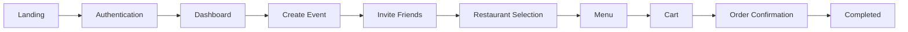

# Design

> This document describes the frontend design system, user experience principles, component architecture, and navigation patterns used in SplitBite.

---

# Table of Contents

- Design Principles
- Technology Stack
- Design System
- Color Palette
- Typography
- Spacing & Layout
- Navigation
- User Flow
- Screen Architecture
- Component Library
- State Management
- Responsive Design
- Accessibility
- Animations
- Future Improvements
- Design Philosophy

---

# Design Principles

SplitBite is designed around three principles:

- **Fast Collaboration** – Users should be able to join and participate in an event within seconds.
- **Minimal Friction** – Reduce unnecessary interactions while ordering.
- **Modern Familiarity** – Follow familiar food delivery patterns inspired by apps users already know.

---

# Technology Stack

| Layer | Technology |
|--------|------------|
| Framework | Next.js (App Router) |
| Language | TypeScript |
| UI Library | React |
| Styling | Tailwind CSS |
| Icons | Lucide React |
| State | Zustand |
| Data Fetching | TanStack Query |
| Forms | React Hook Form |
| Validation | Zod |
| Animations | Framer Motion |

---

# Design System

The interface follows a component-first approach.

### Design Goals

- Clean
- Minimal
- Mobile-first
- Consistent spacing
- High readability
- Fast interactions

---

# Color Palette

| Purpose | Usage |
|----------|-------|
| Primary | Brand actions |
| Secondary | Supporting UI |
| Success | Completed actions |
| Warning | Deadlines |
| Error | Validation & failures |
| Surface | Cards & panels |
| Background | Page background |

---

# Typography

| Element | Usage |
|----------|-------|
| Heading 1 | Page titles |
| Heading 2 | Section titles |
| Body | General content |
| Caption | Metadata |
| Button | CTA labels |

---

# Layout & Spacing

- 8-point spacing system
- Responsive grid layout
- Maximum content width
- Reusable container component
- Consistent card spacing

---

# Navigation

```text
Landing
    │
Login / Signup
    │
Dashboard
    │
├── Create Event
├── Join Event
├── Profile
├── Notifications
└── Event Details
```

---

# User Flow



---

# Screen Architecture

| Screen | Purpose |
|----------|----------|
| Landing | Product introduction |
| Authentication | Login & Signup |
| Dashboard | User overview |
| Event | Collaborative ordering |
| Restaurant | Browse restaurants |
| Menu | Food selection |
| Cart | Review order |
| Profile | User settings |
| Notifications | Activity updates |

---

# Component Library

## Layout

- Navbar
- Sidebar
- Bottom Navigation
- Page Container

## Event

- Event Card
- Participant Avatar
- Countdown Timer
- Activity Feed
- Invite Card

## Restaurant

- Restaurant Card
- Restaurant List
- Cuisine Badge

## Menu

- Menu Item Card
- Quantity Selector
- Veg Indicator
- Price Badge

## AI

- Recommendation Card
- Reminder Banner
- AI Explanation Card

## Payments

- Payment Card
- UPI Card
- Wallet Card

## Shared

- Button
- Input
- Dialog
- Modal
- Toast
- Badge
- Avatar
- Skeleton Loader

---

# State Management

State is divided into two categories.

## Server State

Managed using **TanStack Query**

- Events
- Restaurants
- Menus
- User Profile
- Notifications

## Client State

Managed using **Zustand**

- Authentication
- Current Event
- Selected Restaurant
- Cart
- Theme
- UI State

---

# Responsive Design

The interface follows a mobile-first approach.

| Device | Support |
|----------|----------|
| Mobile | Primary |
| Tablet | Optimized |
| Desktop | Full support |

---

# Accessibility

The application follows common accessibility practices.

- Semantic HTML
- Keyboard navigation
- Screen reader labels
- Visible focus states
- Color contrast compliance

---

# Animations

Animations are intentionally lightweight.

Examples:

- Page transitions
- Modal animations
- Toast notifications
- Loading skeletons
- Button interactions
- Countdown updates

---

# Future Improvements

- Dark mode
- Theme customization
- Better accessibility support
- Offline support
- Progressive Web App
- Multi-language interface

---

# Design Philosophy

SplitBite focuses on reducing the friction of collaborative food ordering. Every interaction is designed to minimize clicks, provide immediate feedback, and keep the user's attention on completing the group order as quickly as possible.
