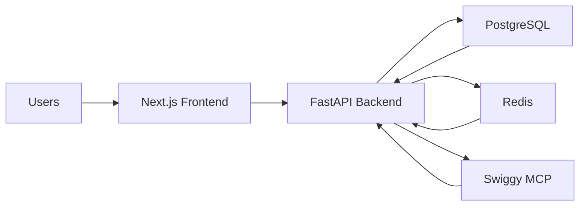
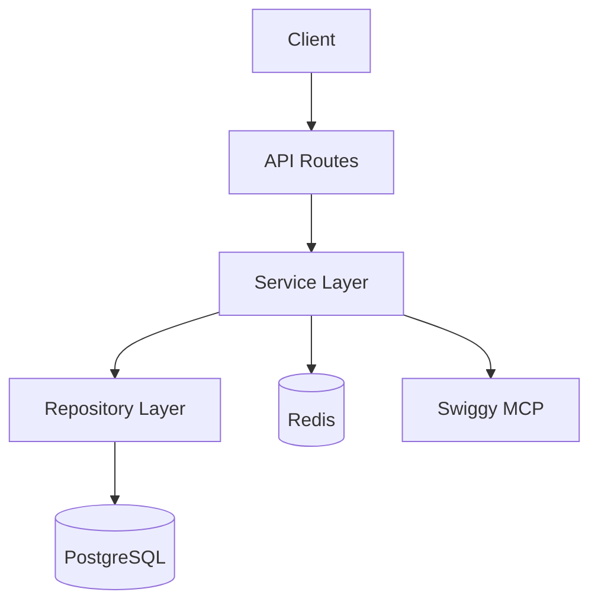
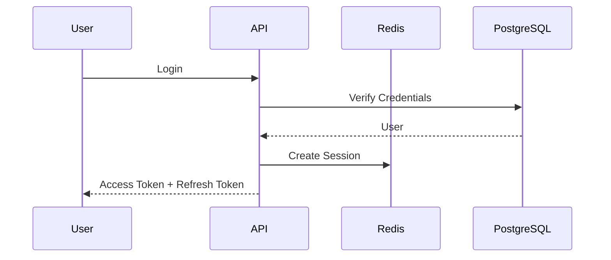
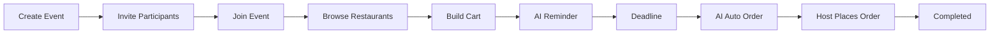
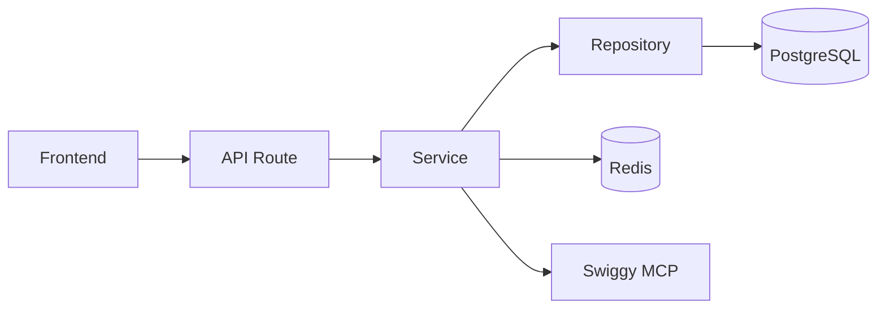
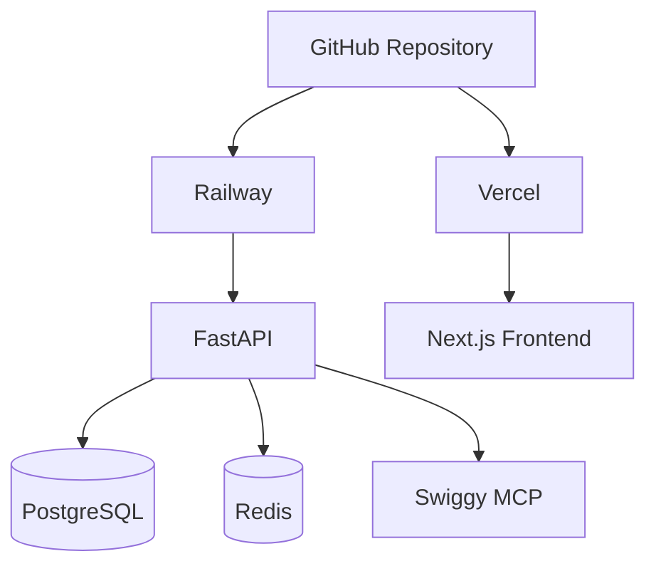

> SplitBite follows a **Modular Monolith** architecture built using **FastAPI**, **PostgreSQL**, and **Redis**. The system is organized into independent feature modules while remaining a single deployable application, making it simple to develop, maintain, and scale.

---

# Table of Contents

- Architecture Overview
- Technology Stack
- High-Level Architecture
- Backend Architecture
- Project Structure
- Core Modules
- Authentication Flow
- Event Lifecycle
- Request Lifecycle
- Redis Architecture
- Deployment Architecture
- Future Improvements

---

# Architecture Overview

SplitBite is a collaborative food-ordering platform that allows multiple users to participate in a single food-ordering session. The backend is designed as a **Modular Monolith**, where every business domain is isolated into its own module while sharing a common application and database.

This architecture provides:

- Clear separation of concerns
- Easier development and testing
- Faster deployment
- Lower operational complexity
- Straightforward migration to microservices in the future

---

# Technology Stack

| Layer | Technology |
|---------|------------|
| Frontend | Next.js, React, Tailwind CSS |
| Backend | FastAPI (Python) |
| ORM | SQLAlchemy |
| Database | PostgreSQL |
| Cache | Redis |
| Authentication | JWT, Refresh Tokens, Google OAuth |
| AI Engine | Rule-based Recommendation Engine |
| External Service | Swiggy MCP |
| Deployment | Railway (Backend), Vercel (Frontend) |

---

# High-Level Architecture



---

# Backend Architecture

SplitBite follows a **Modular Monolith** combined with **Clean Architecture** principles.

Every feature lives in its own module and owns its:

- API Routes
- Business Logic
- Database Access
- Schemas
- Dependencies



---

# Project Structure

```text
backend/

├── app/
│
├── auth/
│   ├── router.py
│   ├── service.py
│   ├── repository.py
│   ├── schemas.py
│   └── models.py
│
├── users/
│
├── events/
│
├── restaurants/
│
├── ai/
│
├── payments/
│
├── notifications/
│
├── activity/
│
├── database/
│
├── core/
│
├── utils/
│
└── main.py
```

---

# Core Modules

| Module | Responsibility |
|----------|----------------|
| Auth | Authentication, Sessions, OAuth |
| Users | User profile & preferences |
| Events | Event lifecycle management |
| Restaurants | Swiggy MCP integration |
| AI | Recommendations, reminders & auto-order |
| Payments | Payment processing |
| Notifications | User notifications |
| Activity | Live activity feed |

---

# Authentication Flow

Users authenticate using either Email & Password or Google OAuth.

After successful authentication:

- Access Token (JWT) is issued.
- Refresh Token is stored securely.
- User session is tracked in Redis.
- Refresh tokens can be revoked independently.



---

# Event Lifecycle



---

# Request Lifecycle

Every request follows the same flow through the application.



---

# Redis Architecture

Redis is used as a high-speed in-memory data store for temporary and frequently accessed data.

| Feature | Purpose |
|----------|---------|
| Sessions | Active user sessions |
| JWT Blacklist | Logout & token invalidation |
| OTP Storage | Temporary authentication data |
| Rate Limiting | API protection |
| Pub/Sub | Event communication |
| Countdown Timers | Event deadline tracking |
| Cache | Frequently accessed data |

---

# Deployment Architecture



---

# Future Improvements

The current architecture is intentionally optimized for an MVP. As SplitBite grows, the following enhancements can be introduced:

- Background job processing
- LLM-powered recommendation engine
- Real-time communication (WebSockets)
- Multi-city support
- Analytics pipeline
- Admin dashboard
- Migration of selected modules into microservices

---

# Architectural Decisions

| Decision | Reason |
|-----------|--------|
| Modular Monolith | Faster development with clear module boundaries |
| PostgreSQL | Strong relational consistency |
| Redis | High-speed caching and session management |
| JWT Authentication | Stateless authentication |
| Google OAuth | Simplified onboarding |
| Polling (v1) | Lower operational complexity than WebSockets |
| Swiggy MCP | Restaurant and menu integration |
| Rule-based AI | Predictable, explainable recommendations with future LLM upgrade path |

---

# Summary

SplitBite is designed as a **Modular Monolith** that emphasizes simplicity, maintainability, and scalability. By combining FastAPI, PostgreSQL, Redis, and a modular architecture, the system provides a strong foundation for rapid development today while allowing a smooth transition to more advanced distributed architectures as the platform grows.
